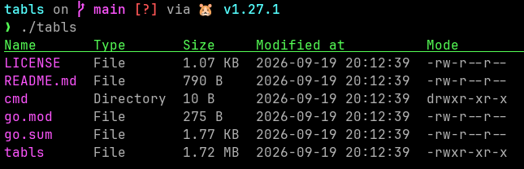

# tabls
Fancy ls-like utility.



## What is this project about?
This is basically just ls except with a more human-friendly, tabular output of a directory's entries.

## Cloning, Compilation & Usage
### Prequisites
You will need: 
- Go 1.27.1+ 
- Git

### Installing with `go install`
```bash
go install github.com/Moritisimor/tabls/cmd/tabls@latest
```

Keep in mind that `~/go/bin` should be in your `$PATH`.

Add it to your path like this:
```bash
export PATH=$PATH:~/go/bin
```

You can also add this line to your `.bashrc` or whatever shell you use.

### Clone & Build
```bash
git clone https://github.com/Moritisimor/tabls
cd tabls
go build -ldflags="-s -w" -o tabls cmd/tabls/main.go
```

### Usage
You can display your current directory like this:
```bash
./tabls
```

You can also recursively calculate the individual directory sizes with the `-r` flag like this:
```bash
./tabls -r
```

To choose a specific directory you can simply supply the path like this:
```bash
./tabls -r my_directory
```

To show hidden files & directories, set the `-a` flag like this:
```bash
./tabls -a
```
